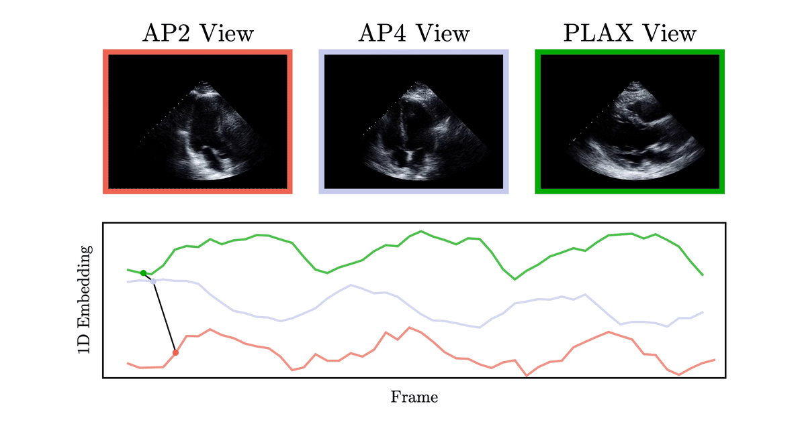

# Echo-SyncNet
### A Self Supervised Neural Network for Synchronization and Cardiac Phase Detection in Echo

Example synchronization of three unique cardiac view angles.

Echo-Synet employs 2D and 3D convolutional neural network layers to encode cardiac echo into low dimensional and feature rich embedding sequences. The embedding vectors carry a powerful semantic undertsanding of the structure and phase of the heart beat, hence multiple videos can be aligned simply by performing feature matching of their embeding sequences. 

 

